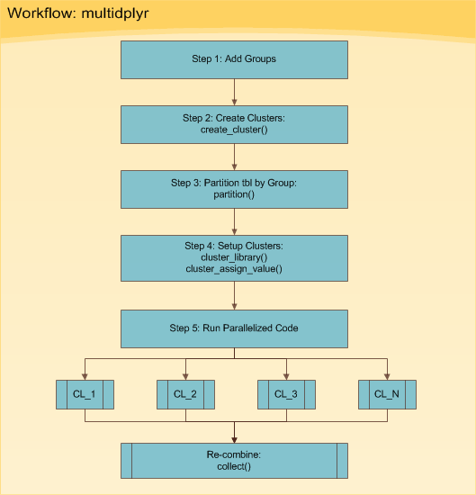

```{r libraryList, eval=TRUE, include=FALSE, echo=TRUE}
knitr::opts_chunk$set(echo = TRUE, 
                      warning = FALSE, 
                      out.width = "200%", 
                      message = FALSE)
```
# Install Pre-requisite R libraries
```{r , eval=TRUE, include=FALSE, echo=TRUE}
if(!require("glue")) {
  install.packages("glue",repos = "http://cran.us.r-project.org", dependencies = TRUE)
  library(glue)
}
#install.packages("glue", repos = "http://cran.us.r-project.org")
install.packages(c("devtools"), repos = "http://cran.us.r-project.org")
library(devtools)

#install.packages("Rcpp", repos = "http://cran.us.r-project.org")
#remove.packages("Rcpp")
install.packages("quantmod", repos = "http://cran.us.r-project.org")
devtools::install_github("hadley/multidplyr")
library(multidplyr)
```

## Loading Packages
-----
- glue
- devtools
- multidplyr
- rvest
- quantmod
- tidyverse
- stringr
- lubridate
- DT
- kableExtra
------

```{r include=FALSE}
library(multidplyr) # parallel processing
library(rvest)      # web scraping
library(quantmod)   # get stock prices; useful stock analysis functions
library(tidyverse)  # ggplot2, purrr, dplyr, tidyr, readr, tibble, stringr and forcats
library(stringr)    # working with strings
library(lubridate)  # working with dates 
library(DT)
library(kableExtra)
```

# Goal
In this assignment, you'll practice collaborating around a code project with GitHub.  You could consider our collective work as building out a book of examples on how to use TidyVerse functions.

GitHub repository:  https://github.com/acatlin/SPRING2019TIDYVERSE

FiveThirtyEight.com datasets:  https://data.fivethirtyeight.com/

Kaggle datasets:  https://www.kaggle.com/datasets

You have two tasks:

1. Create an Example.  Using one or more TidyVerse packages, and any dataset from fivethirtyeight.com or Kaggle, create a programming sample "vignette" that demonstrates how to use one or more of the capabilities of the selected TidyVerse package with your selected dataset. (25 points)
2. Extend an Existing Example.  Using one of your classmate's examples (as created above), extend his or her example with additional annotated code. (15 points)

# Question

Using the historical stock prices in [Kaggle](https://www.kaggle.com/datasets) as [AMEX, NYSE, NASDAQ stock histories](https://www.kaggle.com/qks1lver/amex-nyse-nasdaq-stock-histories#history_60d.csv) analyze the power of computing through parallelizing.

Scripting languages like R and Python for most part run  scripts using only one processor (i.e. core). Under many circumstances this is fine since the computation speed is relatively fast. However, some scripts just take a long time to process, particularly during iterative programming (i.e. using loops to process a lot of data and/or very complex calculations).

Most modern PC's have multiple cores that are underutilized. Parallel processing takes advantage of this by splitting the work across the multiple cores for maximum processor utilization. The result is a dramatic improvement in processing time.

While one may not realize it, most computations in R are loops that can be split using parallel processing. However, parallel processing takes more code and may not improve speeds, especially during fast computations because it takes time to transmit and recombine data. Therefore, parallel processing should only be used when speed is a significant issue.

# Solution

There's nothing more frustrating than waiting for long-running R scripts to run iteratively for long-time. There is a package for parallel processing that plays nicely with the tidyverse: multidplyr. The package saves countless hours when applied to long-running, iterative scripts. Lets discuss the workflow to parallelize code with example of collecting stock prices where it improves speed by over 5X for a process that normally takes 2 minutes or so. This parallelization method can be applied to almost any iterative scripts regardless of application.

The objective is using the multidplyr package, a package designed to do parallel processing within the tidyverse.

When processing time is long, parallel processing could result in a significant improvement. Let's check out how to parallelie the R code using the multidplyr package.

## Workflow

The multidplyr workflow can be broken down into six basic steps shown in



## Web-Scraping WebPage

Collect stock prices using rvest to get the list of S&P500 stocks list from WikiPedia.

The same is available in [Kaggle](https://www.kaggle.com/datasets) as [AMEX, NYSE, NASDAQ stock histories](https://www.kaggle.com/qks1lver/amex-nyse-nasdaq-stock-histories#history_60d.csv) but with 500MB file size freezing my machine's memory.

```{r , eval=FALSE, include=FALSE, echo=FALSE}
library(rvest)
library(DT)
library(kableExtra)
```

```{r, eval=TRUE, include=TRUE, echo=TRUE}
sp_500 <- read_html("https://en.wikipedia.org/wiki/List_of_S%26P_500_companies") %>%
            html_node("table.wikitable") %>%
            html_table() %>%
            select(Symbol, Security) %>%
            as_tibble() %>%
            rename(symbol = Symbol,
                   company = Security)
# Show results
#data.table(sp_500)
DT::datatable(sp_500, options = list(pagelength=5))

```

## Data clean-up via Wrangling

Create a function that leverages the quantmod::getSymbols to return the historical stock prices in tidy format. 
This function will be mapped to all of the 500+ stocks next.

```{r , eval=FALSE, include=FALSE, echo=FALSE}
library(quantmod)
```

```{r, eval=TRUE, include=TRUE, echo=TRUE}
get_stock_prices <- function(symbol, return_format = "tibble", ...) {
    # Get stock prices; Handle errors
    stock_prices <- tryCatch({
        quantmod::getSymbols(Symbols = symbol, auto.assign = FALSE, ...)
    }, error = function(e) {
        return(NA) # Return NA on error
    })
    if (!is.na(stock_prices[[1]])) {
        # Rename
        names(stock_prices) <- c("Open", "High", "Low", "Close", "Volume", "Adjusted")
        
        # Return in xts format if tibble is not specified
        if (return_format == "tibble") {
            stock_prices <- stock_prices %>%
                as_tibble() %>%
                rownames_to_column(var = "Date") %>%
                mutate(Date = ymd(Date))
        }
        return(stock_prices)
    }
}
```

## Data Processing {.tabset .tabset-fade .tabset-pills}
Essentially, lets start with some data set that is needed to do things to multiple times. 

Parallelizing situation generally falls into one of two types:
1. It could be a really large data set that one wants to split up into several small data sets and perform the same thing on each.
2. It could be one data set that one wants to perform multiple things on (e.g. apply many models).

### Serial Data Processing

Collecting twelve years of historical daily stock prices for each of the 500+ stocks. To do this, the script below uses the purrr::map() function to map get_stock_prices() to each stock symbol in sp_500. The loop in our case is the iterative application of a function to each stock. This operation will be split by group in the next section. The proc.time() function is used to time the routine running without parallel processing.

The result, sp_500_processed_in_series is a tibble (tidy data frame) that is nested with two levels: the first has the stock symbol, company, and stock.prices. The variable, stock_prices, contains the historical stock prices for each stock.

```{r, eval=TRUE, include=TRUE, echo=TRUE}
# Map get_stock_prices() to list of stock symbols
from <- "2007-01-01"
to   <- today()

start <- proc.time() # Start clock

sp_500_processed_in_serial <- sp_500 %>%
    dplyr::mutate(stock_prices = purrr::map(.x = symbol, 
                                            ~ get_stock_prices(symbol = .x,
                                                               return_format = "tibble",
                                                               from = from,
                                                               to   = to)
                                            )
                  )

time_elapsed_serial <- proc.time() - start # End clock

head(sp_500_processed_in_serial)

time_elapsed_serial
```

```{r, eval=FALSE, include=TRUE, echo=TRUE}
sp_500_processed_in_series <- sp_500_processed_in_serial %>% mutate(stock_prices = as.data.frame(stock_prices)) %>% tidyr::unnest(stock_prices)
#Error: Each column must either be a list of vectors or a list of data frames [stock_prices]

#sp_500_processed_in_series <- sp_500_processed_in_serial %>% mutate(stock_prices = flatten(stock_prices))
#Error: Column `stock_prices` must be length 505 (the number of rows) or one, not 3521

DT::datatable(sp_500_processed_in_series, options = list(pagelength=5))
```

We just collected twelve years of daily stock prices for over 500 stocks in about 3.5 minutes. 

### Parallel Data Processing

Let's parallelize the computation to get an improvement. We will follow the six steps mentioned in the Workflow

#### Step 0: Get Number of Cores of the Compute Machine (my local machine, in this case)

Determine how many cores local processing machine has. This will be used to determine the number of groups to split the data into in the next set.

```{r}
library(parallel)
cores <- detectCores()
cores
```

#### Step 1: Add Groups

Let's add groups to sp_500. The groups are needed to divide the data across the number cores. For me, this is 4 cores. Then create a group vector, which is a sequential vector of 1:cores (1 to 4) repeated the length of the number of rows in sp_500. Subsequently, add the group vector to the sp_500 tibble using the dplyr::bind_cols() function.

```{r, eval=TRUE, include=TRUE, echo=TRUE}
group <- rep(1:cores, length.out = nrow(sp_500))
sp_500 <- bind_cols(tibble(group), sp_500)
sp_500
```

#### Step 2: Create Clusters

Use the create_cluster() function from the multidplyr package. Think of a cluster as a work environment on a core. Therefore, the code below establishes a work environment on each of the 4 cores.

```{r, eval=TRUE, include=TRUE, echo=TRUE}
cluster <- create_cluster(cores = cores)
cluster
```

#### Step 3: Partition by Group

Next is partitioning. Think of partitioning as sending a subset of the initial tibble to each of the clusters. The result is a partitioned data frame (party_df), which we explore next. Use the partition() function from the multidplyr package to split the sp_500 list by group and send each group to a different cluster.

```{r, eval=TRUE, include=TRUE, echo=TRUE}
by_group <- sp_500 %>%
    partition(group, cluster = cluster)
by_group
```

The result, by_group, looks similar to our original tibble, but it is a partitioned data frame, which is very different. The key is to notice that the there are 4 Shards. Each Shard has between 126 and 128 rows, which evenly splits our data among each shard. Now that our tibble has been partitioned into a party_df, we are ready to move onto setting up the clusters.

#### Step 4: Setup Clusters

The clusters have a local R work environment, which doesn't work for the vast majority of cases. Code typically depends on libraries, functions, expressions, variables, and/or data that are not available in base R. Fortunately, there is a way to add these items to the clusters. 

For our computation, we are going to need to add several libraries along with the get_stock_prices() function to the clusters. This is done by using the cluster_library() and cluster_assign_value() functions, respectively.

```{r, eval=TRUE, include=TRUE, echo=TRUE}
from <- "2007-01-01"
to   <- today()

# Utilize pipe (%>%) to assign libraries, functions, and values to clusters
by_group %>%
    # Assign libraries
    cluster_library("tidyverse") %>%
    cluster_library("stringr") %>%
    cluster_library("lubridate") %>%
    cluster_library("quantmod") %>%
    # Assign values (use this to load functions or data to each core)
    cluster_assign_value("get_stock_prices", get_stock_prices) %>%
    cluster_assign_value("from", from) %>%
    cluster_assign_value("to", to)
```

#### Step 5: Run Parallelized Code

Now that we have our clusters and partitions set up and everything looks good, we can run the parallelized code. The code chunk is the same as the series code chunk with two exceptions:

1. Instead of starting with the sp_500 tibble, we start with the by_group party_df
2. We combine the results at the end using the collect() function

```{r, eval=TRUE, include=TRUE, echo=TRUE}
start <- proc.time() # Start clock

sp_500_processed_in_parallel <- by_group %>% # Use by_group party_df
    mutate(
        stock_prices = map(.x = symbol, 
                           ~ get_stock_prices(symbol = .x,
                                              return_format = "tibble",
                                              from = from,
                                              to   = to)
                           )
        ) %>%
    collect() %>% # Special collect() function to recombine partitions
    as_tibble()   # Convert to tibble

time_elapsed_parallel <- proc.time() - start # End clock

head(sp_500_processed_in_parallel)

time_elapsed_parallel
```

```{r, eval=FALSE, include=TRUE, echo=TRUE}
sp_500_processed_in_parallelize <- sp_500_processed_in_parallel %>% tidyr::unnest()
#Error: Each column must either be a list of vectors or a list of data frames [issues]

#sp_500_processed_in_parallelize <- sp_500_processed_in_parallel %>% mutate(stock_prices = flatten(stock_prices))
#Error: Column `stock_prices` must be length 505 (the number of rows) or one not 3521

DT::datatable(sp_500_processed_in_parallelize, options = list(pagelength=5))
```

The processing time is approximately 0.38 minutes, which is 5X faster!

## Conclusion 

```{r}
#typeof(time_elapsed_serial)
#typeof(time_elapsed_parallel)

processing_time_comparison <- as.data.frame(as.matrix(rbind(time_elapsed_serial, time_elapsed_parallel), ncol=3, byrow=TRUE)) %>% select_if(~sum(!is.na(.)) > 0)
  
colnames(processing_time_comparison) <- c("User Time","System Time","Total Elapsed Time")
rownames(processing_time_comparison) <- c("Serial","Parallel")
kable(processing_time_comparison)
```

Parallelizing code can drastically improve speed on multi-core machines. It makes the most sense in situations involving many iterative computations. On an higher core machine, processing time will significantly improve. It will not be quite always be as many times faster as the number  of cores, but the longer the computation the closer the speed gets to the full capacity improvement. 

Note that because of transmission time as data is sent to and from the nodes and also lower CPU cores one may not get full capacity improvement. With that said, the speed will approach full capacity improvement with higher multi-core CPU machines as calculations become longer since the transmission time is fixed whereas the computation time is variable. 

With help of tidyverse package, we were able to demonstrate the five main steps in the multidplyr workflow on a real world example of collecting historical stock prices for a large set of stocks. The beauty is that the packages and workflow can be applied to anything from collecting stocks to applying many models to computing n-grams on textual data and more!

For a computation that takes 3 minutes under normal conditions, we improved the processing speed by over 5X to 40 secs through parallel processing!!!
